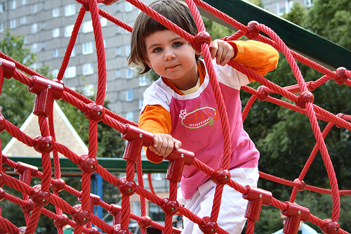

# Image-Captioning-Inceptionv3-LSTM

This project implements an image captioning model using a combination of CNN and LSTM networks. The model takes an image as input and generates a descriptive caption.

## Example Result

*Caption: "A little boy in a white shirt is pointing at the camera."*

## Model Details

The model is composed of:
- **CNN (Convolutional Neural Network)** to extract image features, in this model is InceptionV3.
- **LSTM (Long Short-Term Memory)** network to generate the sequence of words for the caption.

### Features
- Supports beam search for caption generation.
